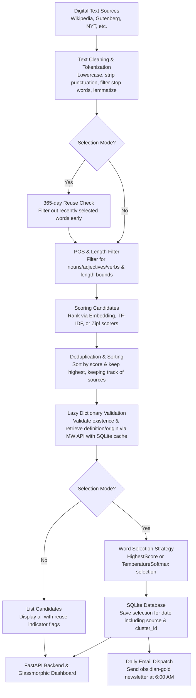

# Word of the Day Portal & Pipeline

A comprehensive daily vocabulary generator, analytics pipeline, and portal dashboard. The application extracts word candidates from a variety of digital text sources, filters them using lemmatization, Part-of-Speech, and length constraints, ranks them using semantic embeddings or TF-IDF, validates candidates on-demand via the Merriam-Webster API with SQLite caching, selects the final word using a Softmax temperature selector, serves them via a FastAPI backend, and delivers them via a daily email newsletter pipeline.

---

## Features

- **Multi-Source Corpus Ingestion**: Fetches raw texts from Wikipedia, Project Gutenberg (by ID or random), the New York Times API, Quotable API, PoetryDB, and Substack publication feeds in parallel, working alongside cached words in the local SQLite database.
- **Word Source Tracking**: Retains the origin/source of each cached candidate word (e.g. `gutenberg`, `wikipedia`, `substack`) throughout database queries, scoring, and client-facing displays instead of generic `"Database"` labelling.
- **Softmax Temperature Selection Strategy**: Replaces strict maximum (argmax) selection with a probability-based selection strategy scaled by a configurable temperature parameter (e.g., `softmax` vs `argmax`), allowing tunable creativity and variety in daily word generation.
- **Daily Email Newsletter Pipeline**:
  - Automatically dispatches a beautifully styled obsidian-gold responsive HTML email to active subscribers daily at 6:00 AM (America/Chicago time).
  - High-performance, RFC-compliant bulk newsletter sending with standard headers (`List-Unsubscribe`, bulk headers, and plain-text fallback content).
  - Configurable daily limit cap protection (`SMTP_MAX_EMAILS_PER_DAY`) with automatic administrator alert notifications when the dispatch limit is reached.
  - Interactive portal interface (`GET /subscribe`) and REST endpoints (`POST /api/subscribe`, `GET /api/unsubscribe`) for subscriptions and secure one-click unsubscribing.
- **Part-of-Speech & Length Filtering**: Uses NLTK's averaged perceptron tagger to filter out filler words and prepositions, retaining only high-utility nouns, adjectives, and verbs, while enforcing minimum and maximum length bounds.
- **Dynamic Semantic Clustering & Rotation**: Seed embeddings are clustered via K-Means (optimal cluster count $K$ determined on-the-fly via the Elbow Method). The pipeline rotates to the next cluster daily, scoring candidates against the active cluster centroid to ensure semantic variety.
- **FastAPI Backend Server**:
  - `GET /`: Serves the glassmorphic analytics dashboard.
  - `GET /subscribe`: Serves the email newsletter subscription portal.
  - `GET /admin`: Serves the password-protected admin dashboard.
  - `GET /api/word?date=YYYY-MM-DD`: Returns the selection for a date. Features a self-healing client that dynamically queries the Merriam-Webster API for missing definitions or word origins on-demand and caches them locally.
  - `GET /api/dates`: Returns a sorted list of dates with selected words for calendar integration.
  - `GET /api/history?limit=N`: Fetches recent historical selections.
  - `GET /api/embeddings/grid`: Returns PCA-reduced 2D coordinates and cluster IDs for the word history, used to render the interactive embedding visualization.
  - `GET /healthz`: Liveness/readiness database probe for container health checks.
  - `POST /api/subscribe`: Subscribes a new email address to the newsletter.
  - `GET /api/unsubscribe?token=TOKEN`: Safe one-click unsubscribe endpoint.
  - `POST /api/admin/login`: Authenticates with the admin password and returns a bearer token.
  - `POST /api/admin/word`: Manually saves a word for a given date (auto-validates via dictionary API if no definition is provided).
  - `DELETE /api/admin/word?date=YYYY-MM-DD`: Removes a word entry for a specific date.
  - `GET /api/admin/history`: Retrieves word selection history for the admin dashboard.
  - `GET /api/admin/stats`: Returns database statistics (total words, cache sizes, subscription counts, DB file size).
  - `POST /api/admin/cache/clear`: Purges the dictionary validation cache.
  - `POST /api/admin/send-email`: Triggers a manual email newsletter dispatch for a given date.
  - `GET /api/admin/logs?lines=N`: Returns the last N lines of the application log.
  - `POST /api/admin/explore`: Runs a live candidate exploration pipeline from selected sources and returns scored, validated candidates with source metadata.
- **Premium Glassmorphic UI**: Responsive dashboard with active word card (incorporating text-to-speech pronunciation, copy-to-clipboard, dynamic origin/etymology display), an interactive embedding visualization grid, and a slide-out, fully-interactive calendar showing dates with data.
- **Admin Dashboard**: A separate protected UI (`/admin`) for managing words, exploring candidates, sending emails manually, clearing caches, viewing logs, and monitoring database statistics.
- **Robust Background Scheduler**: A lightweight background daemon thread scheduler that runs daily candidate selection in a separate subprocess, avoiding circular dependency risks and memory leaks, and orchestrates daily email dispatch checks.
- **Hardened Web Security**: FastAPI backend configured with CORS, Gzip compression, and strict security headers (Content-Security-Policy, HSTS, X-Content-Type-Options, X-Frame-Options, Referrer-Policy).
- **Container Readiness**: Built-in container healthcheck targeting a `/healthz` liveness/readiness database probe.
- **Bootstrap Utilities**: Script to fetch new words from the Merriam-Webster podcast RSS feed to update the seed word list (`word_of_the_day_embeddings.csv`).

---

## Architecture & Data Flow

The diagram below outlines how text is ingested, filtered, validated, scored, and served as the daily Word of the Day.



### Detailed Processing Steps

1. **Ingestion**: Raw text corpora are retrieved from Wikipedia, Project Gutenberg, New York Times API, Quotable API, PoetryDB, or Substack publication feeds (run in parallel) or cached candidates in the local SQLite database.
2. **Text Cleaning & Tokenization**: Raw text is normalized to lowercase, non-alphabetic characters are removed, and words are filtered against a configurable stop-words list (`stop_words.txt`). Simplemma is optionally used to reduce words to their base form (lemmatization).
3. **Reusability Check (Early Filtering in Selection Modes)**: When running in selection modes (`auto` or `interactive`), the pipeline queries the SQLite database and filters out any candidate selected as a Word of the Day within the last 365 days.
4. **Part-of-Speech, Length, & Zipf Frequency Filtering**: Words are evaluated via NLTK's POS tagger to keep only nouns, adjectives, or verbs (configurable) and checked against length constraints (`MIN_WORD_LENGTH`, `MAX_WORD_LENGTH`). Additionally, words are filtered against a "goldilocks" Zipf frequency range (`MIN_SCORE` and `MAX_SCORE`) using `wordfreq` to filter out overly common words (e.g., "the") and overly obscure words (e.g., typos or jargon).
5. **Scoring & Ranking**:
   - **Embedding Scorer (Default)**: Candidate words are embedded using a SentenceTransformer model (e.g., `all-MiniLM-L6-v2`) and compared against the active target centroid. The seed embeddings are clustered using K-Means, and the optimal number of clusters $K$ is determined via the Elbow Method. The scoring process rotates to a new cluster each day (`(last_used_cluster_id + 1) % K`), scoring candidates directly against that cluster's centroid to ensure day-to-day semantic variety.
   - **TF-IDF Scorer**: Ranks candidates using Term Frequency-Inverse Document Frequency across the ingested documents.
   - **Zipf Scorer**: Ranks candidates strictly by Zipf frequency/rarity using `wordfreq` (rarer words within the configured goldilocks range are ranked higher).
6. **Deduplication & Sorting**: Candidates are deduplicated across sources (prioritizing active web scraping sources over database-cached words) and sorted by score, while maintaining tracking of the original source metadata.
7. **Lazy Dictionary Validation**: Top candidates are validated against the Merriam-Webster API to confirm they are real English words and to retrieve their definitions and etymology/origin. Validations are checked on-demand and stop as soon as the target selection candidate limit (`limit`) is met. Validations are cached in SQLite to minimize network calls.
8. **Selection & Persistence**: In **Auto Mode**, the selector chooses the final word. If using `softmax` selection strategy, a Softmax probability distribution of candidate scores scaled by a temperature parameter decides the word. If `argmax` strategy is active, the highest scorer is picked. In **Interactive Mode**, the user can manually choose from the top candidates. In **List Mode**, all candidates are printed. The chosen word, definition, origin, source, score, and rotation `cluster_id` are persisted in the SQLite database (`word_of_the_day.db`).
9. **Delivery**: The FastAPI application exposes endpoint APIs to retrieve the selected word. Simultaneously, if email notifications are enabled, a daily background task dispatches the newsletter to all active subscribers.

---


## Setup & Installation

This project uses `uv` for fast dependency and environment management.

### Prerequisites

Make sure you have [uv](https://github.com/astral-sh/uv) installed. If not, you can install it via:
```bash
curl -LsSf https://astral.sh/uv/install.sh | sh
```

### Installation

To sync all dependencies (including optional dev and api packages):
```bash
make install
```
*(This is equivalent to running `uv sync`)*

### Environment Configuration

Copy the sample environment file and configure variables as needed:
```bash
cp .env.example .env
```

Key environment configurations available in `.env`:

| Variable | Default | Description |
| :--- | :--- | :--- |
| `NYT_API_KEY` | *(empty)* | Required if using the New York Times connector. |
| `MERRIAM_WEBSTER_API_KEY` | *(empty)* | Required for dictionary validation. |
| `MIN_SCORE` | `2.3` | Lower bound of the Zipf frequency range. |
| `MAX_SCORE` | `4.0` | Upper bound of the Zipf frequency range. |
| `LIMIT` | `3` | Number of candidates to validate/extract per source. |
| `USE_EMBEDDINGS` | `True` | Toggle semantic embedding scoring. |
| `SELECTION_STRATEGY` | `softmax` | Word selection strategy (`softmax` or `argmax`). |
| `SELECTION_TEMPERATURE` | `1.0` | Tunable Softmax temperature parameter (higher = more uniform/random). |
| `USE_LEMMATIZATION` | `True` | Toggle lemmatizing words via Simplemma. |
| `POS_FILTER_NOUNS` | `True` | Keep and filter candidate nouns. |
| `POS_FILTER_ADJECTIVES` | `True` | Keep and filter candidate adjectives. |
| `POS_FILTER_VERBS` | `True` | Keep and filter candidate verbs. |
| `MIN_WORD_LENGTH` | *(empty)* | Minimum length bounds of candidate words. |
| `MAX_WORD_LENGTH` | *(empty)* | Maximum length bounds of candidate words. |
| `EMBEDDING_MODEL` | `all-MiniLM-L6-v2` | Hugging Face SentenceTransformer model name. |
| `EMBEDDING_K` | `5` | Fixed cluster count override (bypasses Elbow Method if set). |
| `SEED_CSV_PATH` | `word_of_the_day_embeddings.csv` | Path to the seed word list CSV. |
| `CACHE_NPZ_PATH` | `word_of_the_day_embeddings.npz` | Path to the precomputed embedding cache. |
| `DB_PATH` | *(project root)* | Override SQLite database file path. |
| `ADMIN_PASSWORD` | `admin123` | Password for the `/admin` dashboard. **Change before deploying.** |
| `CORS_ORIGINS` | `["*"]` | Restrict to your domain(s) in production. |
| `DISABLE_API_DOCS` | `False` | Set to `True` to hide `/docs`, `/redoc`, and `/openapi.json`. |
| `SCHEDULER_ENABLED` | `True` | Toggle the background daily scheduler. |
| `SMTP_BACKEND` | `console` | SMTP client backend (`smtp` or `console`). |
| `SMTP_HOST` | `localhost` | Host for the SMTP server. |
| `SMTP_PORT` | `587` | Port for the SMTP server. |
| `SMTP_USERNAME` | *(empty)* | Username for SMTP authentication. |
| `SMTP_PASSWORD` | *(empty)* | Password for SMTP authentication. |
| `SMTP_FROM_EMAIL` | `noreply@wordoftheday.com` | Sender address for daily digest emails. |
| `SMTP_FROM_NAME` | `word.` | Sender display name. |
| `SMTP_USE_TLS` | `True` | Toggle TLS for SMTP transport. |
| `SMTP_USE_SSL` | `False` | Toggle SSL for SMTP transport. |
| `SMTP_MAX_EMAILS_PER_DAY` | `200` | Hard cap on the number of emails sent per day. |
| `SMTP_ADMIN_NOTIFICATION_EMAIL` | *(empty)* | Email address to receive alerts if limits are hit. |
| `APP_BASE_URL` | `http://localhost:8000` | Base URL for constructing unsubscribe links. |
| `LOG_FILE` | `logs/app.log` | Path to the rotating log file. |
| `LOG_LEVEL` | `INFO` | Root log level. |
| `LOG_LEVEL_CONSOLE` | `INFO` | Console handler log level. |
| `LOG_LEVEL_FILE` | `DEBUG` | File handler log level. |

---

## Usage & Commands

All development tasks are pre-configured in the `Makefile`.

### CLI Executable

Run the main application CLI via `uv`:
```bash
uv run word_of_the_day [options]
```

#### Operation Modes (`--mode`)

1. **List Candidates (`list`)**
   Finds and scores candidate words without saving them.
   ```bash
   uv run word_of_the_day --mode list --source wikipedia
   ```

2. **Automated Selection (`auto`)**
   Executes the pipeline, selects the best candidate for a given date (using the configured selection strategy), and saves it in the database.
   ```bash
   uv run word_of_the_day --mode auto
   ```

3. **Interactive Selection (`interactive`)**
   Presents candidates and allows you to manually select the word of the day.
   ```bash
   uv run word_of_the_day --mode interactive --source poetry_db
   ```

4. **Manual Assignment (`set`)**
   Manually assigns a specific word to a date.
   ```bash
   uv run word_of_the_day --mode set --word "sagacious" --date 2026-07-12
   ```

5. **Start API Server (`api`)**
   Starts the FastAPI portal server locally.
   ```bash
   uv run word_of_the_day --mode api
   ```

6. **Send Emails Daily Digest (`send-emails`)**
   Dispatches the daily email digest to active subscribers for a given date.
   ```bash
   uv run word_of_the_day --mode send-emails --date 2026-07-18
   ```

### Development Commands

| Task | Make Command | Direct `uv` Command | Description |
| :--- | :--- | :--- | :--- |
| **Sync Dependencies** | `make install` | `uv sync` | Synchronize package dependencies. |
| **Run Default CLI** | `make run` | `uv run word_of_the_day` | Runs the CLI app with defaults. |
| **Run Tests** | `make test` | `uv run pytest` | Run the unit and integration test suite. |
| **Watch Tests** | `make test-watch` | `uv run ptw` | Run tests in watch mode. |
| **Coverage Report** | `make test-cov` | `uv run pytest --cov=src ...` | Run tests and generate coverage. |
| **Lint Code** | `make lint` | `uv run ruff check .` | Run style checks with Ruff. |
| **Format Code** | `make format` | `uv run ruff format .` | Format codebase using Ruff. |
| **Type Check** | `make typecheck` | `uv run mypy src` | Run static type analysis with mypy. |

---

## Seed Data & Bootstrapping

The project uses a seed word list to compute semantic similarity for candidate scoring:

- `word_of_the_day_embeddings.csv`: The primary seed word list (word + date pairs). Populated from the Merriam-Webster podcast RSS feed.
- `word_of_the_day_embeddings.npz`: Precomputed SentenceTransformer embeddings of the seed words. Automatically generated or regenerated from the CSV on first use.

To fetch the latest words from the Merriam-Webster podcast RSS feed and update the seed list:
```bash
uv run python bootstrap_word_of_the_day.py
```

The script reads `SEED_CSV_PATH` from the environment (defaulting to `word_of_the_day_embeddings.csv`), incrementally fetches only new entries since the last run, and writes the updated CSV back to disk.

> **Note**: Inside the Docker container, the bootstrap script runs automatically on startup if no seed CSV is found at the configured `SEED_CSV_PATH`.

---

## Project Structure

```text
.
├── Dockerfile                        # Multi-stage slim non-root Docker runtime config
├── Makefile                          # Easy commands for local development
├── README.md                         # Project documentation (this file)
├── bootstrap_word_of_the_day.py      # Script to sync new words from the MW podcast RSS feed
├── docker-compose.yml                # Compose service for the API with named volume mounts
├── pyproject.toml                    # UV project configuration and dependencies
├── spec.md                           # Feature Specification: Softmax Temperature Selection
├── stop_words.txt                    # Configurable stop words list for text tokenization
├── word_of_the_day.db                # SQLite database (history, dictionary cache & subscriptions)
├── word_of_the_day_embeddings.csv    # Seed word list (word + date from MW podcast)
├── word_of_the_day_embeddings.npz    # Precomputed embeddings cache file
├── src/
│   └── word_of_the_day/
│       ├── connectors/               # Source connectors (Wikipedia, Gutenberg, NYT, etc.)
│       ├── static/                   # Dashboard web assets (index.html, subscribe.html, admin.html, JS, CSS)
│       ├── utils/                    # Common text helpers and source name mapping
│       ├── api.py                    # FastAPI server: public endpoints, subscriptions & admin API
│       ├── cli.py                    # CLI arg parser and entry point
│       ├── config.py                 # Pydantic Settings configuration (reads from .env)
│       ├── dictionary.py             # HTTPX-based Merriam-Webster API validator/fetcher
│       ├── email_sender.py           # Daily newsletter email templates and SMTP/console batch dispatch logic
│       ├── generator.py              # Candidate word parser from source texts
│       ├── logger.py                 # Rotating file + console logging setup
│       ├── main.py                   # CLI orchestrator and pipeline bootstrapper
│       ├── pipeline.py               # Candidate scoring and pipeline orchestration
│       ├── scheduler.py              # Background daemon thread scheduler and daily email dispatch check
│       ├── scorers.py                # Zipf frequency, SentenceTransformer embeddings, TF-IDF, and Composite scorers
│       ├── selectors.py              # Word selector strategies (HighestScore/argmax and TemperatureSoftmax)
│       └── storage.py                # SQLite database manager (WAL mode, subscription tracking, and schema migrations)
└── tests/                            # Comprehensive testing suite
    ├── test_email_pipeline.py        # Integration and unit tests for SMTP/console email dispatching
    ├── test_selectors.py             # Unit tests verifying probability distribution and numerical stability of selectors
    └── ...                           # Other module-specific test suites
```

---

## Container Deployment

The application is containerized with production-grade security defaults:
- **Non-Root User**: The container runs under `appuser` (UID `10001`), ensuring compatibility with strict container security policies (e.g., Kubernetes root restrictions).
- **Pre-baked ML Model**: The `all-MiniLM-L6-v2` SentenceTransformer model is downloaded during the Docker build and cached in the image, so the container starts without requiring a network download.
- **Auto-Bootstrap**: On startup, if no seed CSV is found at `SEED_CSV_PATH`, the container automatically runs `bootstrap_word_of_the_day.py` to seed the word list from the Merriam-Webster podcast RSS feed.
- **Health Checks**: A liveness/readiness probe checks `/healthz` on a 30s interval.

### Running with Docker Compose (Recommended)

Starts the FastAPI server with a host bind mount (mapping the project root) for the SQLite database, embeddings, and seed CSV:

```bash
docker compose up -d
```

The portal will be available at [http://localhost:8000](http://localhost:8000) and the admin dashboard at [http://localhost:8000/admin](http://localhost:8000/admin).

The host project root directory is bind mounted to `/app/db` inside the container. The environment in `docker-compose.yml` sets the database and seed paths to this directory:
```
DB_PATH=/app/db/word_of_the_day.db
SEED_CSV_PATH=/app/db/word_of_the_day_embeddings.csv
CACHE_NPZ_PATH=/app/db/word_of_the_day_embeddings.npz
```

### Running with Docker CLI

1. **Build the Image**
   ```bash
   docker build -t word-of-the-day .
   ```

2. **Run the API Server**
   ```bash
   docker run -d \
     -p 8000:8000 \
     --name wotd-api \
     -v $(pwd):/app/db \
     -v $(pwd)/logs:/app/logs \
     -e DB_PATH=/app/db/word_of_the_day.db \
     -e SEED_CSV_PATH=/app/db/word_of_the_day_embeddings.csv \
     -e CACHE_NPZ_PATH=/app/db/word_of_the_day_embeddings.npz \
     --env-file .env \
     word-of-the-day
   ```

3. **Run One-off CLI Pipeline Modes**
   ```bash
   # List candidates
   docker run --rm word-of-the-day --mode list

   # Auto-select today's word
   docker run --rm \
     -v $(pwd):/app/db \
     -e DB_PATH=/app/db/word_of_the_day.db \
     word-of-the-day --mode auto
   ```

### Multi-Platform Builds (Docker Buildx)

To build and push a multi-platform image (supporting both `linux/amd64` and `linux/arm64` via a Docker manifest list) from your Mac:

1. **Create and Use a Builder Instance** (only needed once):
   ```bash
   docker buildx create --name wotd-builder --use
   docker buildx inspect --bootstrap
   ```

2. **Build and Push the Image**:
   Multi-platform builds typically require pushing directly to a remote registry (e.g., Docker Hub or GitHub Container Registry) since the default local Docker daemon cannot store multi-platform images in its legacy image store:
   ```bash
   docker buildx build \
     --platform linux/amd64,linux/arm64 \
     -t <your-registry-username>/word_of_the_day:latest \
     --push .
   ```

---

## Admin Dashboard

The admin dashboard at `/admin` provides a password-protected web interface for managing the application. Authenticate using the `ADMIN_PASSWORD` environment variable (default: `admin123` — **change this before deploying**).

Available admin capabilities:

| Feature | Description |
| :--- | :--- |
| **Word Management** | Manually add or delete a word for any date. Definitions are auto-fetched from Merriam-Webster if omitted. |
| **Daily Email Newsletter Dispatch** | Manually trigger dispatch of the Word of the Day email newsletter to all active subscribers. |
| **Live Exploration** | Run the candidate pipeline on-demand against selected sources and see scored, validated candidates with tagged sources. |
| **Database Stats** | View total word count, dictionary cache size, source breakdown, active newsletter subscribers, and database file size. |
| **Cache Management** | Clear the Merriam-Webster dictionary validation cache. |
| **Log Viewer** | View the last N lines of the application log file. |
