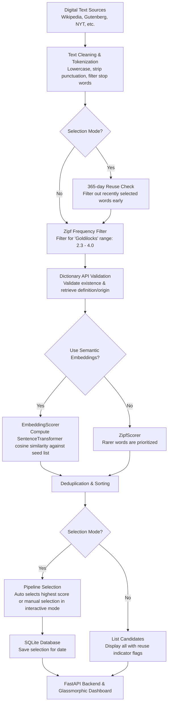

# Word of the Day Portal & Pipeline

A comprehensive daily vocabulary generator, analytics pipeline, and portal dashboard. The application extracts word candidates from a variety of digital text sources, filters them using Zipf frequency metrics, ranks them using semantic embeddings against historical selections, and serves them via a FastAPI backend and a premium glassmorphic web dashboard.

---

## Features

- **Multi-Source Corpus Generation**: Fetches raw texts from Wikipedia, Project Gutenberg (by ID or random), the New York Times API, Quotable API, PoetryDB, and Substack publication feeds.
- **Zipf Frequency Filtering**: Uses `wordfreq` to filter out words that are too common (e.g. conversational words) or too obscure (e.g. OCR noise, rare technical jargon).
- **Semantic Embedding Similarity**: Employs `sentence-transformers` (`all-MiniLM-L6-v2` by default) to compare candidate embeddings against a seed database of past selections, maintaining a cohesive, sophisticated vocabulary flavor.
- **FastAPI Backend Server**:
  - `GET /`: Serves the glassmorphic analytics dashboard.
  - `GET /api/word?date=YYYY-MM-DD`: Returns the selection for a date. Features a self-healing client that dynamically queries the Free Dictionary API for missing definitions or word origins on-demand.
  - `GET /api/history?limit=N`: Fetches recent historical selections.
- **Premium Glassmorphic UI**: Responsive dashboard with active word details, historical selection lookup, and a recent selections sidebar.
- **Automated Background Scheduler**: A lightweight background daemon thread scheduler that triggers daily candidate selection at midnight America/Chicago (no OS `cron` or root permissions required).
- **Hardened Web Security**: FastAPI backend configured with CORS, Gzip compression, and strict security headers (Content-Security-Policy, HSTS, X-Content-Type-Options, X-Frame-Options, Referrer-Policy).
- **Container Readiness**: Built-in container healthcheck targeting a `/healthz` liveness/readiness database probe.
- **Bootstrap Utilities**: Interactive script to fetch new words from podcast RSS feeds to update the baseline seed words.

---

## Architecture & Data Flow

The diagram below outlines how text is ingested, filtered, validated, scored, and served as the daily Word of the Day.



### Detailed Processing Steps

1. **Ingestion**: Raw text corpora are retrieved from Wikipedia, Project Gutenberg, New York Times API, Quotable API, PoetryDB, or Substack publication feeds.
2. **Text Cleaning & Tokenization**: Raw text is normalized to lowercase, non-alphabetic characters are removed, and words are filtered against a configurable stop-words list.
3. **Reusability Check (Early Filtering in Selection Modes)**: When running in selection modes (`auto` or `interactive`), the pipeline queries the SQLite database and filters out any candidate selected as a Word of the Day within the last 365 days *before* performing any Zipf frequency filter, dictionary API calls, or embedding calculation. This avoids wasting network requests and GPU/CPU time.
4. **Zipf Frequency Filter**: Candidate words are evaluated using the Zipf frequency scale via `wordfreq`. Words that are too common (e.g., "the", "hello") or too rare/OCR noise (e.g., "xjfje") are excluded using a target frequency range (default: `2.3` to `4.0`).
5. **Dictionary Validation**: Candidates are validated against the Free Dictionary API to confirm they are real English words and to retrieve their official definitions and etymology/origin.
6. **Scoring & Ranking**:
   - **Embedding Scorer (Default)**: Candidate words are embedded using a SentenceTransformer model (e.g., `all-MiniLM-L6-v2`) and compared against a golden seed list of past selections (`bootstrap.csv`). The score is the average cosine similarity of the candidate's embedding to its $K$-nearest neighbors in the seed list. This aligns the vocabulary with a sophisticated, literary tone.
   - **Zipf Scorer (Fallback)**: Candidates are ranked strictly by rarity (lower Zipf score represents rarer, more interesting words).
7. **Deduplication & Sorting**: Candidates are deduplicated and sorted by their final score.
8. **Selection & Persistence**: In **Auto Mode**, the highest-ranked candidate is automatically selected. In **Interactive Mode**, the user can manually choose from the top candidates. In **List Mode**, all candidates are printed (with previously used ones flagged). The chosen word, definition, origin, source, and score are persisted in the SQLite database (`word_of_the_day.db`).
9. **Delivery**: The FastAPI application exposes endpoint APIs (`/api/word`) to retrieve the selected word and serves them to the interactive web portal.

---


## Setup & Installation

This project uses `uv` for fast dependency and environment management.

### Prerequisites

Make sure you have [uv](https://github.com/astral-sh/uv) installed. If not, you can install it via:
```bash
curl -LsSf https://astral.sh/uv/install.sh | sh
```

### Installation

To sync all dependencies (including optional dev and api packages):
```bash
make install
```
*(This is equivalent to running `uv sync`)*

### Environment Configuration

Copy the sample environment file and configure variables as needed:
```bash
cp .env.example .env
```

Key environment configurations available in `.env`:
- `NYT_API_KEY`: Required if using the New York Times connector.
- `MIN_SCORE` & `MAX_SCORE`: Zipf frequency ranges (default: `2.3` to `4.0`).
- `USE_EMBEDDINGS`: Toggle semantic embedding scoring (`True`/`False`).
- `EMBEDDING_MODEL`: Hugging Face SentenceTransformer model name.
- `SEED_CSV_PATH` / `CACHE_NPZ_PATH`: Paths to the baseline seed lists and precomputed embedding caches.

---

## Usage & Commands

All development tasks are pre-configured in the `Makefile`.

### CLI Executable

Run the main application CLI via `uv`:
```bash
uv run word_of_the_day [options]
```

#### Operation Modes (`--mode`)

1. **List Candidates (`list`)**
   Finds and scores candidate words without saving them.
   ```bash
   uv run word_of_the_day --mode list --source wikipedia
   ```

2. **Automated Selection (`auto`)**
   Executes the pipeline, selects the best candidate for a given date, and saves it in the database.
   ```bash
   uv run word_of_the_day --mode auto
   ```

3. **Interactive Selection (`interactive`)**
   Presents candidates and allows you to manually select the word of the day.
   ```bash
   uv run word_of_the_day --mode interactive --source poetry_db
   ```

4. **Manual Assignment (`set`)**
   Manually assigns a specific word to a date.
   ```bash
   uv run word_of_the_day --mode set --word "sagacious" --date 2026-07-12
   ```

5. **Start API Server (`api`)**
   Starts the FastAPI portal server locally.
   ```bash
   uv run word_of_the_day --mode api
   ```

### Development Commands

| Task | Make Command | Direct `uv` Command | Description |
| :--- | :--- | :--- | :--- |
| **Sync Dependencies** | `make install` | `uv sync` | Synchronize package dependencies. |
| **Run Default CLI** | `make run` | `uv run word_of_the_day` | Runs the CLI app with defaults. |
| **Run Tests** | `make test` | `uv run pytest` | Run the unit and integration test suite. |
| **Watch Tests** | `make test-watch` | `uv run ptw` | Run tests in watch mode. |
| **Coverage Report** | `make test-cov` | `uv run pytest --cov=src ...` | Run tests and generate coverage. |
| **Lint Code** | `make lint` | `uv run ruff check .` | Run style checks with Ruff. |
| **Format Code** | `make format` | `uv run ruff format .` | Format codebase using Ruff. |
| **Type Check** | `make typecheck` | `uv run mypy src` | Run static type analysis with mypy. |

---

## Seed Data & Bootstrapping

The project contains historical seed words to compute semantic similarity:
- `bootstrap.csv`: A pre-loaded list of 7,200+ Merriam-Webster Word of the Day selections.
- `word_of_the_day_embeddings.npz`: Pre-calculated embeddings of seed words to speed up pipeline execution.

To retrieve the latest words from the Merriam-Webster podcast RSS feed and update the seed file:
```bash
uv run python bootstrap_word_of_the_day.py
```

---

## Project Structure

```text
.
├── Dockerfile                        # Multi-stage slim non-root Docker runtime config
├── Makefile                          # Easy commands for local development
├── README.md                         # Project documentation (this file)
├── bootstrap.csv                     # Historical Merriam-Webster selections
├── bootstrap_word_of_the_day.py      # Script to sync new words from RSS feeds
├── docker-compose.yml                # Compose service for the API and volume mounts
├── pyproject.toml                    # UV project configuration and dependencies
├── word_of_the_day.db                # SQLite database (history & seeds)
├── word_of_the_day_embeddings.npz    # Precomputed embeddings cache file
├── src/
│   └── word_of_the_day/
│       ├── connectors/               # Source connectors (WP, Gutenberg, NYT, etc.)
│       ├── static/                   # Dashboard web assets (HTML, JS, CSS)
│       ├── utils/                    # Common text helpers
│       ├── api.py                    # FastAPI server endpoints
│       ├── cli.py                    # CLI arg parser
│       ├── config.py                 # Pydantic Settings configuration
│       ├── dictionary.py             # HTTPX-based Dictionary API validator/fetcher
│       ├── generator.py              # Candidate parser from source texts
│       ├── logger.py                 # Rotational logging setup
│       ├── main.py                   # CLI orchestrator and configuration loaders
│       ├── pipeline.py               # Candidate scoring and pipeline orchestration
│       ├── scheduler.py              # Background daemon thread scheduler
│       ├── scorers.py                # Zipf frequency and Embedding scorers
│       └── storage.py                # SQLite database manager (WAL and busy-timeout enabled)
└── tests/                            # Comprehensive testing suite (154 tests)
```

---

## Container Deployment

The application is containerized with production-grade security defaults:
- **Non-Root User**: The container runs under `appuser` (UID `10001`), ensuring compatibility with strict container security policies (e.g., Kubernetes root restrictions).
- **Health Checks**: A liveness/readiness probe checks `/healthz` on a 30s interval.

### Running with Docker Compose (Recommended)

Starts the FastAPI server and keeps your SQLite database and logs persisted:

```bash
docker compose up -d
```
The portal will be available at [http://localhost:8000](http://localhost:8000).

### Running with Docker CLI

1. **Build the Image**
   ```bash
   docker build -t word-of-the-day .
   ```

2. **Run the API Server**
   ```bash
   docker run -d \
     -p 8000:8000 \
     --name wotd-api \
     -v $(pwd)/word_of_the_day.db:/app/word_of_the_day.db \
     -v $(pwd)/logs:/app/logs \
     --env-file .env \
     word-of-the-day
   ```

3. **Run One-off CLI Pipeline Modes**
   ```bash
   # List candidates
   docker run --rm word-of-the-day --mode list

   # Auto-select today\'s word
   docker run --rm \
     -v $(pwd)/word_of_the_day.db:/app/word_of_the_day.db \
     word-of-the-day --mode auto
   ```
